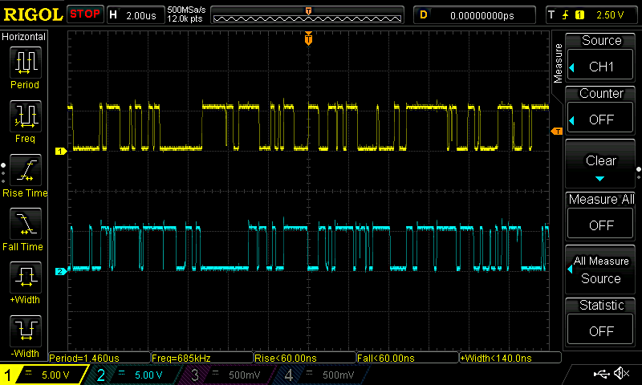

footer: Kenji Rikitake / IPSJ IOTS2015
slidenumbers: true

# Affordable hardware random number generator (HRNG)

<!-- Use Deckset 1.4, Titillium theme, 4:3 aspect ratio -->

---

## Kenji Rikitake

## りきたけ けんじ

## 力武 健次

27-NOV-2015
IPSJ IOTS2015 WIP
Chiba, Japan
@jj1bdx

CC-BY-SA 4.0

---

# Executive summary:

# USE HRNG NOW
## For all host systems
## For all smartphones
## For all IoT systems
## And use a trustable HRNG

---

# Isn't HRNG expensive?
# __NO__
# It's already affordable!
## A JPY1500 board will make a host computer secure enough

---

# Affordable?

## Cheaper than JPY10000 per each
## Preferably cheaper than JPY3000
## Or even more cheaper
# Price now: JPY1500

---

# Why HRNG? __Mandatory for security!__

## Keys: TLS, SSH, DNSSEC, passwords
## Load balancing with minimal bias
## Fairness for gambling applications

---

# Isn't /dev/urandom enough?
#  
# __NO__

## (if without HRNG)

---

# Why /dev/urandom is not enough?

## Insufficient seeding
## Too small entropy harvestable
## Being spent by too many applications

---

# Why Intel's rdrand (or similar) is not enough?

## __PROPRIETARY__ hardware
## Possible __BACKDOORS__
## Might be too __SLOW__ 

---

# Why __original__ HRNG?

## Required for __sufficient strength__ of seeding /dev/[u]random
## Fast and sufficient seeding
## Fast enough to feed all applications

---

## "OK then show us what you've got"
# avrhwrng
# ST Dongle for NeuG

---

# avrhwrng
## With 8bit AVR Arduino
## Reverse biased diodes
## ~10kbytes/sec
## DC 12V required
## Arduino shield

---

# More avrhwrng
## 74HCU04 x 1
## 2N3904 x 4
## All available in Akizuki Denshi 秋月電子通商
## Parts cost: ~JPY500

---

---
# avrhwrng amplifiers

---
# Why __two__ diodes?

## Differential input to remove environmental common-mode effects
## ... Or simply two-bit parallelism
## Can be extended to more bits/sample

---
# NeuG
## g新部 Yutaka Niibe-san's GPLv3 HRNG software for ARM Cortex-M3
### RNG for GnuK secure GnuPG HW key generator/saver software
### No external power required
### ~80kbytes/sec

---

# ST Dongle for NeuG

---

# STM32 Nucleo-64
## ST-LINK/V2-1 part: reconfigurable for NeuG
## And STM32F103 target: __also__ reconfigurable as a NeuG
## JPY1500/board for __TWO__ NeuGs

---

# FreeBSD HRNG code
## Requires a device driver to use random\_harvest(9) and rndtest(4)
## ... so I wrote a driver and feeder for FreeBSD 10.2-STABLE
## Working stably for months

---

# On choosing hardware

## __Japanese semiconductors are no longer available__ for prototyping
## Use (American) well-known semiconductors instead (e.g., 2SC1815 -> 2N3904)

---

# For more bandwidth

## Parallelism (bits/sample)
## A simple I/O with FTDI FT232R/245R?
## More sampling speed
## R820T SDR + rtl\_entropy?

---

# For more applications

## Stable operation infrastructure needed for fault tolerance
## Expertise on production-level cases (e.g., DNSSEC, PKI key generation)
## Windows? OS X? Android? iOS?

---

# My codes and docs in GitHub

* https://github.com/jj1bdx/avrhwrng
* https://github.com/jj1bdx/freebsd-dev-trng
* https://github.com/jj1bdx/osx-devrandom-feeder

---

# NeuG codes and docs

* http://git.gniibe.org/gitweb/
* http://www.gniibe.org/memo/development/gnuk/rng/neug.html
* 日本語: http://www.gniibe.org/memo/development/gnuk/hardware/stm32-nucleo-f103.html

---

# Other projects

* See Wikipedia entry called __Comparison of Hardware Random Number Generators__
* https://en.wikipedia.org/wiki/Comparison_of_hardware_random_number_generators

---

# Thanks
# Questions?

