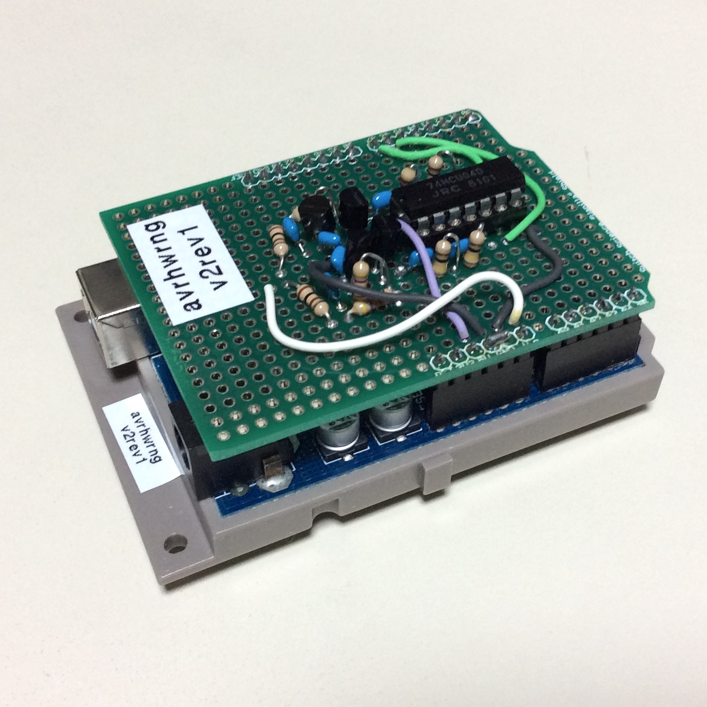
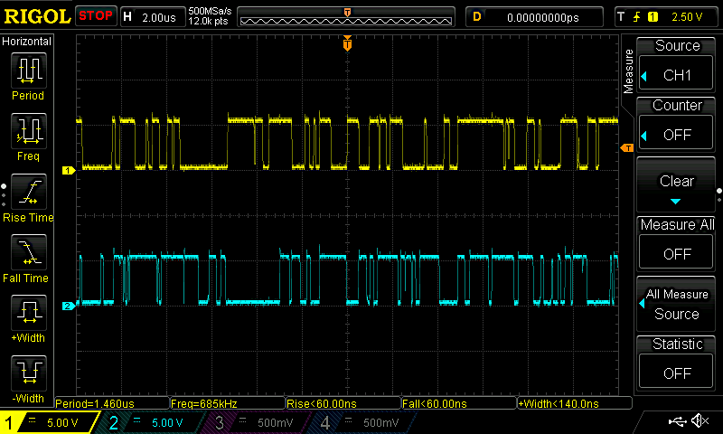
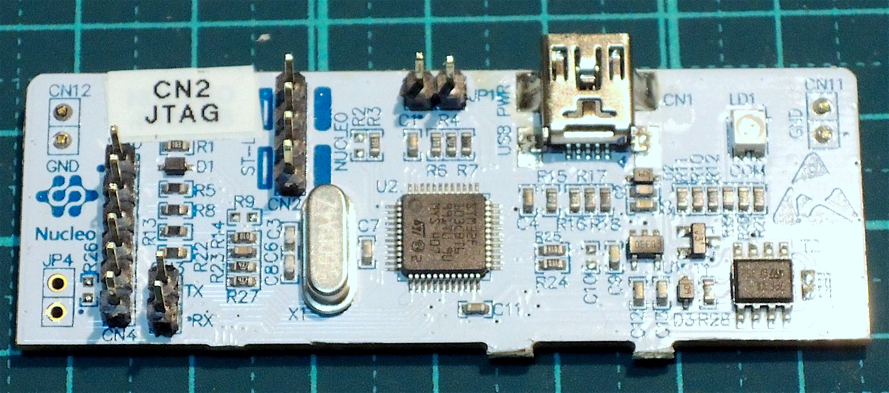
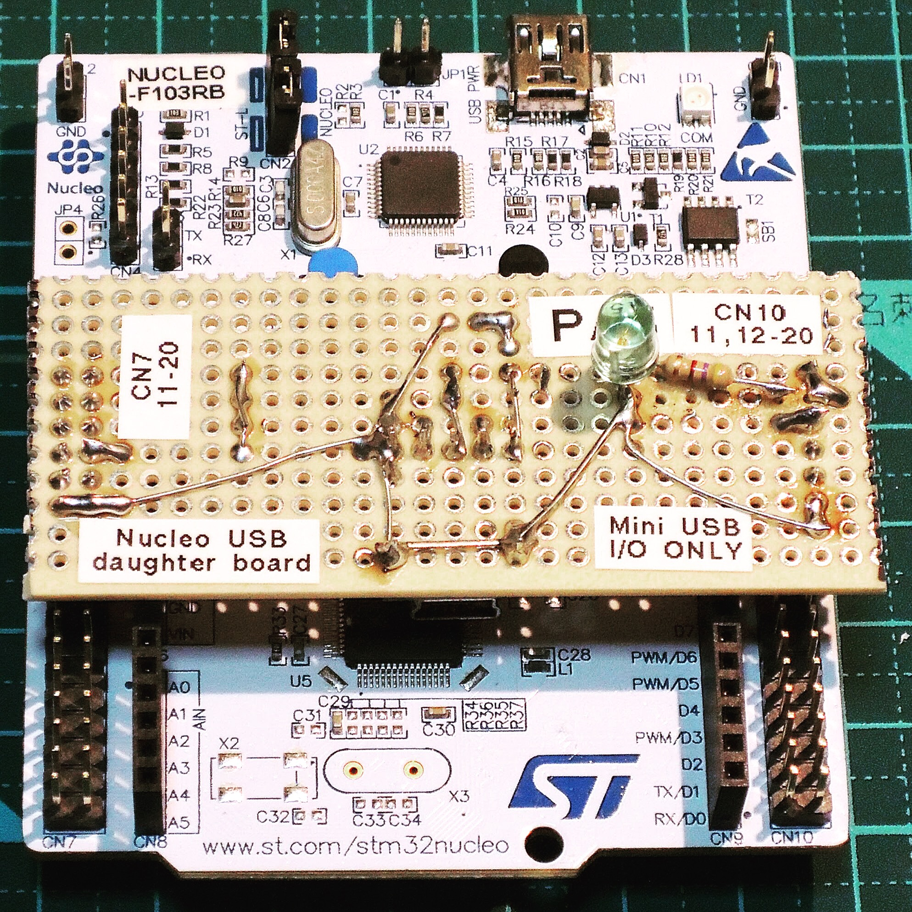

footer: Kenji Rikitake / IPSJ IOTS2015
slidenumbers: true

# Affordable hardware random number generators (HRNGs)

<!-- Use Deckset 1.4, Zurich theme, 16:9 aspect ratio -->

---

# Kenji Rikitake

りきたけ けんじ

力武 健次

27-NOV-2015
IPSJ IOTS2015 WIP
Chiba, Japan
@jj1bdx

CC-BY 4.0

---

# Executive summary: USE HRNG NOW

* For all host systems
* For all smartphones
* For all IoT systems
* And use a trustable HRNG

---

# Isn't HRNG expensive?

*NO*

It's already affordable!

A JPY1500 board will make a host computer secure enough

---

# Affordable?

* Cheaper than JPY10000 per each
* Preferably cheaper than JPY3000
* Or even more cheaper
* *Price now: JPY1500 for each*

---

# Why HRNG? *Mandatory for security!*

* Keys: TLS, SSH, DNSSEC, passwords
* Load balancing with minimal bias
* Fairness for gambling applications

---

# Isn't /dev/urandom enough?

*NO*

(if without HRNG)

---

# Why /dev/urandom is not enough?

* Insufficient seeding
* Harvestable entropy too small
* Harvested entropy is spent by too many applications simultaneously

---

# Why Intel's rdrand (or similar HRNG of other chip vendors) is not enough?

* *PROPRIETARY* hardware
* Possible *BACKDOORS*
* Might be too *SLOW* (taking hundreds of system clocks for each call)

---

# Why *original* HRNG?

* Required for *sufficient strength* of seeding /dev/[u]random
* Fast and more unpredictable seeding
* Fast enough to feed all applications through making /dev/[u]random sufficiently random

---

# Obtaining statistically sound result

* Periodic measurement of output statistical characteristics is required
* The same measurement for *raw* output is recommended for early failure detection
* Whitening by cryptographic hash functions (SHA256, SHA512, etc) is necessary to obrain statistically good and sound result 

---

# "OK then show us what you've got"

* avrhwrng
* ST Dongle for NeuG

## Both are USB CDC-ACM devices

* Accessible as modem/tty devices

---

# avrhwrng

* With 8bit AVR Arduino
* Reverse biased diodes
* ~10kbytes/sec (raw output: ~80kbytes/sec)
* DC 12V required
* Arduino shield

---

# avrhwrng parts

* 74HCU04 x 1
* 2N3904 x 4
* All available in Akizuki Denshi 秋月電子通商
* Parts cost: ~JPY500

---

---
# avrhwrng amplifiers

---
# Why *two* diodes?

* Differential input for removing environmental common-mode effects
* ... Or simply two-bit parallelism
* Can be extended to more bits/sample

---
# NeuG

* Yutaka Niibe's GPLv3 HRNG software for ARM Cortex-M3 including Flying Stone's FST-01
* RNG for GnuK, a secure cryptographic token hardware usable on GnuPG and OpenSSH
* No external power required
* Using internal A/D converter noise as the randomness source
* ~80kbytes/sec (with internal whitening)

---

# ST Dongle for NeuG

---

# STM32 Nucleo-64

* ST-LINK/V2-1 part: reconfigurable for NeuG
* And STM32F103 target: *also* reconfigurable as a NeuG
* JPY1500/board for *TWO* NeuGs

---

# FreeBSD HRNG code

* Requires a device driver to use random\_harvest(9) and rndtest(4)
* ... so I wrote a driver and feeder for FreeBSD 10.2-STABLE
* Working stably for months

---

# On choosing hardware

*Japanese semiconductors are no longer available* for prototyping: use (American) well-known semiconductors instead (e.g., 2SC1815 -> 2N3904)

---

# For more bandwidth

* Parallelism (bits/sample): a simple I/O with FTDI FT232R/245R?
* More sampling speed: R820T SDR + rtl\_entropy?

---

# For more applications

* Stable operation infrastructure needed for fault tolerance
* Expertise on production-level cases (e.g., DNSSEC, PKI key generation)
* We need more internal information for seeding the system PRNG by the external devices: Windows? OS X? Android? iOS? Other proprietary platforms?

---

# My codes and docs in GitHub

* <https://github.com/jj1bdx/avrhwrng>
* <https://github.com/jj1bdx/freebsd-dev-trng>
* <https://github.com/jj1bdx/osx-devrandom-feeder>

---

# NeuG codes and docs

* <http://git.gniibe.org/gitweb/>
* <http://www.gniibe.org/memo/development/gnuk/rng/neug.html>
* 日本語: <http://www.gniibe.org/memo/development/gnuk/hardware/stm32-nucleo-f103.html>

---

# Other projects

* See Wikipedia entry called [Comparison of Hardware Random Number Generators](https://en.wikipedia.org/wiki/Comparison_of_hardware_random_number_generators)

---

# Thanks

Questions?

